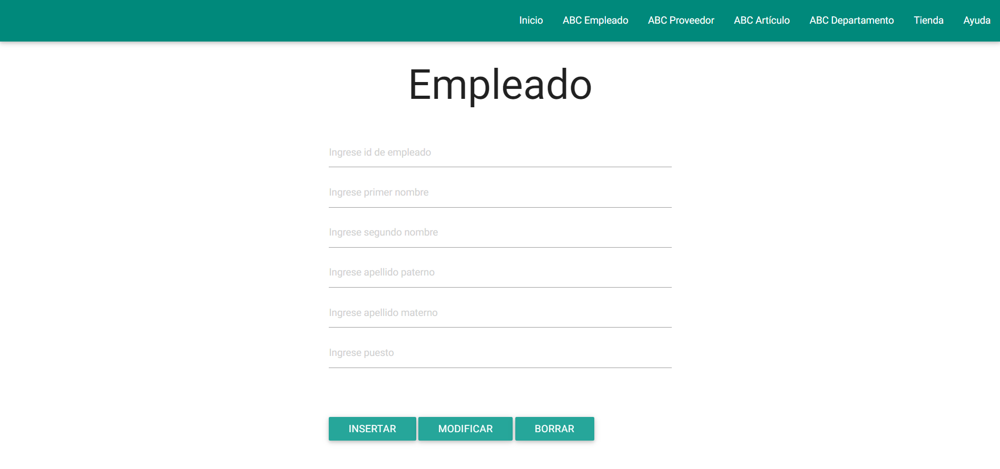

# Base-de-Datos-Proyecto

## Tabla de Contenido
- [Información General](#información-general)
- [Desarrollo del proyecto](#desarrollo-del-proyecto) 
	  * [Modelo ER](#modelo-er)
	  * [Servidor](#servidor)
	  * [Gestor de Base de Datos](#gestor-de-base-de-datos)
- [Sistema web](#sistema-web)
	* [Inicio](#inicio)
	* [ABCEmpleado](#abcempleado)
	* [ABCProveedor](#abcproveedor)
	* [ABCArtículo](#abcartículo)
	* [ABCDepartamento](#abcDepartamento)
	* [Tienda](#tienda)
	* [Ayua](#ayuda)
	* 
## Información General
Este proyecto consiste en el desarrollo de un sistema de inventario web para una tienda de abarrotes pequeña de la materia de Base de Datos.

## Desarrollo del proyecto
Como clientes de tiendas pequeñas (abarrotes), nos percatamos que la mayoría no cuentan con algún sistema informático que les permita registrar ventas, productos, existencias, etc, sus registros son manuales, escritos en papel, lo que puede ser tedioso, cansado y propenso a perder información.
Por resta razón, nosotros planteamos y desarrollamos un sistema para ser implementado en una tienda y así facilitar el manejo de información y trabajo.
Entre las ventajas que destacan al usar el sistema es:  
* Mejorar el control de la tienda sobre sus productos. 
* Detectar cuando y cuantos productos se necesitan para evitar mermas, perdida de dinero y espacio físico innecesario.
* Facilitar el trabajo en la tienda.

### Modelo ER
La siguiente imagen contiene el modelo creado con la herramienta de  software MySQL Workbench, que fue desarrollado e implementado en nuestro proyecto.
Cabe recalcar que se le aplicó formalización a cada una de las tablas para un mejor funcionamiento del sistema.

	

### Servidor
Se utilizó el siguiente servidor gratuito.

	

### Gestor de Base de Datos
Se utilizó el siguiente software para gestionar la base de datos.

	

## Sistema web

### Inicio
Una vez ingresado al sitio, será direccionado a la página de principal. En la parte superior se incorporó un menú agradable a la vista para el fácil acceso de las pestañas como lo muestra la imagen.

	

### ABCEmpleado
En esta pestaña se encuentra un formulario a completar para registrar empleados que pertenecen a un departamento,  la tabla muestra los registros y modificaciones realizadas, el campo “ingresa idEmpleado” es un valor único, además se habilitó que el “ingresa segundo nombre” fuera nulo ya que no muchas personas tienen este nombre. El campo “ingresa puesto” es donde se ingresa el puesto al que pertenece el empleado. Todo los campos están validados.

	
  

### ABCProveedor
La pestaña cuenta con un formulario para ingresar los datos de los proveedores. También cuenta con las mismas validaciones que la pestaña empleado a excepción de que se agregó un campo para teléfono y empresa proveniente del proveedor.

	
  

### ABCArtículo
La pestaña muestra un formulario para registrar los artículos que entrarán a el almacén, cada uno tiene un identificador único en caso de que se repita el código de barras, stock para ingresar la cantidad de productos y para revisar la existencia de estos. Todo producto debe contar con una fecha de caducidad e identificador de proveedor y departamento para saber a cual corresponde. Aquí se emplea el procedimiento de validar a el proveedor.

	
  

### ABCDepartamento
El apartado muestra un formulario con los datos básicos del departamento. Se agregó el campo “ingrese id de empleado” para tener un control de que empleados pertenecen a un departamento específico. 

	

### Tienda
Esta pestaña también cuenta con un formulario a llenar, se le agregó el campo de “ingresar id de  artículo” para saber que productos pertenecen a una tienda identificada por su id único. Se incorporó un disparador para restar la existencia de artículos que es activado cuando el procedimiento realiza los cálculos para verificar que se cuenta con los productos necesarios para llevar a cabo el proceso que es reflejado en la pestaña de artículos.

	
  

### Ayuda
En esta sección se explica como insertar, modificar y borrar los datos.
Nota: Este sistema fue diseñado para uso de  personal autorizado para evitar la pérdida de información.

	

